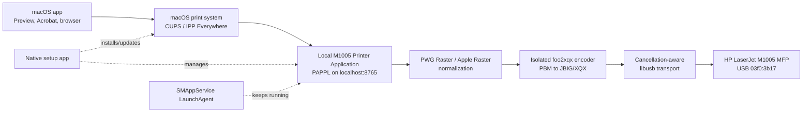
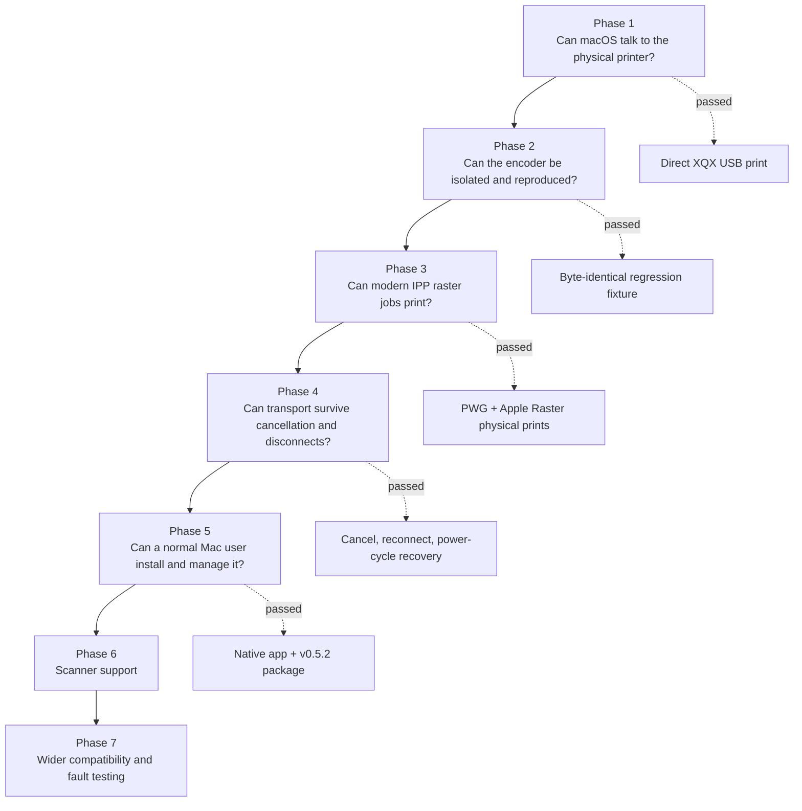
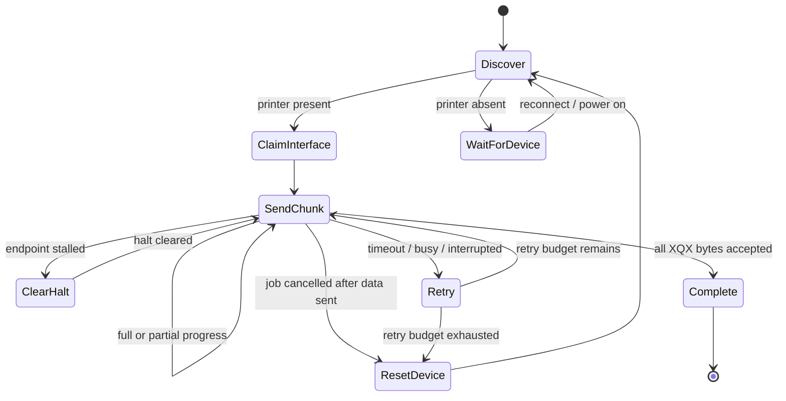

# Keeping Good Hardware Alive: Building a Modern macOS Driver for the HP LaserJet M1005 MFP

*A development story about refusing to replace a perfectly functional printer just because its software support ended.*

## The problem: the printer worked, but the bridge had disappeared

I own an HP LaserJet M1005 MFP. It is old, but it is not broken. The mechanics are sound, the laser engine prints cleanly, the USB connection works, and the device still does the job it was built to do.

The problem appeared when I moved to a MacBook running macOS 26 Tahoe.

I searched HP's support pages, Apple's printer packages, GitHub repositories, forums, archived installers, and open-source printing projects. I could find old software, but I could not find a ready-to-install driver that was signed, notarized, and verified to work with this printer on current macOS.

Apple's last general HP printer package explicitly says that it is **not compatible with macOS 12 and newer**. In practical terms, that leaves macOS 11 Big Sur as the package's nominal ceiling, with stronger real-world evidence around Catalina and older releases. The package may still be downloadable, but availability is not compatibility. See [Apple's HP Printer Drivers v5.1.1 page](https://support.apple.com/en-us/106385).

That created an absurd situation: the printer was healthy, the Mac was healthy, and the USB cable was healthy, but the software bridge between them had been abandoned.

I did not want to buy a new printer merely because I had bought a Mac.

## The motivation: compatibility should not decide when hardware becomes waste

Replacing the M1005 would have been the easiest consumer answer. It was not the answer I wanted.

If the printer's engine had failed, replacement would make sense. If toner was unavailable, replacement might make sense. But neither was true. Only the driver—the medium translating a modern print job into the printer's language—was incompatible.

As a coder, that changed the question from:

> “Which new printer should I buy?”

to:

> “What is the smallest modern compatibility layer that can keep this printer useful?”

That was the beginning of the project.

My goal was not to force an obsolete installer onto a new operating system. I wanted to build a native, user-space solution shaped around current macOS printing standards: Apple Silicon, IPP Everywhere, modern raster formats, a managed background service, clean installation and removal, and no disabling of System Integrity Protection.

The project was developed and physically tested on macOS 26.5.2 on Apple Silicon. Its architecture is intentionally modern and portable, but that is different from claiming that every macOS release and every Mac model has already been tested.

## The idea: make an old USB printer look modern to macOS

The breakthrough was to stop thinking in terms of a traditional PPD-and-filter driver.

OpenPrinting explains that classic CUPS drivers and raw queues are deprecated, and that **Printer Applications** are the bridge for older devices: they behave like modern IPP printers on one side and translate jobs for legacy hardware on the other. See [OpenPrinting's Printer Applications overview](https://openprinting.github.io/cups/drivers.html).

That suggested a clean architecture:

To macOS, the application looks like a driverless IPP printer. Internally, it converts the incoming raster into the proprietary XQX stream understood by the M1005 and sends that stream over the printer-class USB interface.

This design avoided a kernel extension. It also avoided changing protected system directories or asking users to weaken macOS security.

## Research and findings

The search did uncover valuable building blocks, just not a complete modern driver.

### 1. The protocol implementation already existed

[OpenPrinting/foo2zjs](https://github.com/OpenPrinting/foo2zjs) contains explicit HP LaserJet M1005 support and the `foo2xqx` encoder for the printer's XQX language. That saved the project from blind protocol reverse engineering.

However, the surrounding installation stack was from another era: legacy shell tooling, Foomatic, PPDs, old CUPS driver conventions, and obsolete macOS installation advice. Reusing the proven encoder made sense; reviving the entire old installation model did not.

### 2. The printer exposed a normal USB printer-class interface

USB discovery showed vendor/product ID `03f0:3b17`. Interface 1 was a bidirectional printer-class interface with bulk OUT endpoint `0x02` and bulk IN endpoint `0x82`.

Most importantly, libusb could claim and release that interface directly in normal macOS user space. That meant I did **not** need a kernel extension or a USBDriverKit system extension for the validated path.

### 3. The hardware's real capability boundary mattered

The physically proven mode was:

- A4
- monochrome
- 600 × 600 dpi
- simplex
- multi-page documents
- printer-side copies

A direct 300 × 300 test exposed invalid zero-valued XQX video metadata. Rather than advertise an attractive but unreliable option, the application deliberately exposes 600 dpi only.

### 4. Modern macOS distribution is more than producing a `.pkg`

A trustworthy public package must sign every nested executable with a Developer ID Application certificate, sign the installer with a Developer ID Installer certificate, enable Hardened Runtime, submit the package to Apple's notary service, and staple the returned ticket. Apple's current requirements are documented in [Notarizing macOS software before distribution](https://developer.apple.com/documentation/security/notarizing-macos-software-before-distribution).

The build now automates that workflow, although the development package remains unsigned until the required Developer ID identities are installed locally.

## The phase-wise plan

I divided the work so that every phase answered one risky question before the next layer was added.

### Phase 1: prove the hardware and protocol path

The first deliverable was intentionally small: a native arm64 command-line tool that could discover the printer, claim only its printer interface, and send a known XQX job.

The first successful A4 test used a 4960 × 7016 monochrome raster at 600 dpi. `foo2xqx` converted it into a 2,717-byte XQX stream, and libusb transferred every byte to endpoint `0x02`. The page printed exactly and completely.

That one sheet became more than a success—it became a regression oracle. Its source PBM and final XQX stream were hashed and preserved. Later builds would have to reproduce the exact bytes.

Phase 1 then expanded into multi-page documents, printer-side copies, cancellation, USB reconnect, and a cold printer power cycle.

One important failure shaped the recovery design: the printer did not acknowledge the standard USB printer-class soft-reset request. A full libusb device reset did work. The correct cancellation sequence therefore became: stop output, reset the device, rediscover it, reclaim the interface, and reopen the transport.

### Phase 2: isolate and modernize the encoder

The upstream code was useful, but it came from a large historical printing stack. I extracted only what the M1005 path required:

- the PBM-to-XQX encoder
- XQX protocol definitions
- JBIG-KIT encoding/decoding
- a diagnostic XQX decoder
- upstream license notices

The isolated encoder was moved to strict modern C11 with current Apple Clang warnings treated as errors. Unsafe or obsolete constructs were replaced, resolution validation was tightened, file handling was made binary-safe, and a deterministic timestamp hook was added for reproducible tests.

The decisive test was byte-for-byte equality with the XQX stream that had physically printed in Phase 1. That meant a refactor could not silently change the device protocol while still appearing logically correct.

### Phase 3: build the Printer Application

The next step introduced PAPPL 1.4.11 as the local IPP Everywhere service.

macOS could now send PWG Raster and Apple Raster to a local printer queue. The application accepted those jobs, normalized the page, called the isolated encoder as a child process, and transmitted XQX through a custom `m1005usb://` PAPPL device.

The child-process boundary was deliberate. The historical encoder used global state and fatal process exits. Running it out of process prevented one malformed job from crashing the long-lived printer service.

A geometry mismatch also appeared here: CUPS represented exact A4 at 600 dpi as 4960 × 7015 pixels, while the already validated XQX path used 4960 × 7016. The bridge added one white bottom row, preserving the printer geometry that had already passed physically.

One PWG Raster page and one Apple Raster page then printed completely and identically through the IPP queue.

### Phase 4: make USB transport boring

Printing one page is a demo. Recovering from real-world interruptions is a driver.

I extracted the USB write policy into a deterministic state machine. It uses 16 KiB transfers, preserves progress across short writes, retries transient errors, clears endpoint stalls, checks cancellation frequently, and fails immediately when the device disappears.

Physical tests removed the USB cable and powered the printer off. Jobs stayed queued rather than being lost. Reconnecting the cable or powering the printer back on caused discovery, encoding, transmission, and printing to resume automatically—without restarting the service or recreating the queue.

### Phase 5: turn engineering tools into a Mac application

The final print milestone was usability.

I built a native AppKit setup and status application. It detects the USB printer, registers a background LaunchAgent through `SMAppService`, starts the local IPP service, adds or updates the macOS queue, shows status and logs, and removes the integration cleanly.

The installed application is entirely user-space. It does not require a kernel extension, SIP changes, or files inside `/System`.

Packaging revealed a new class of problems:

- The Phase 4 executable still referenced Homebrew libusb and OpenSSL paths. The packaged service was changed to link PAPPL, libusb, OpenSSL, and the encoder support statically so an end user's Mac would not need Homebrew.
- LaunchAgent execution exposed a bundle-relative `argv[0]`. Encoder discovery was changed to use the executable's real macOS path instead of assuming the current working directory.
- Ad-hoc development signatures changed whenever the bundle changed, and macOS cached helper identities during repeated upgrades. Development LaunchAgent identifiers were rotated while testing. A public Developer ID signature will provide the stable identity expected for normal upgrades.
- The setup flow learned to migrate both PAPPL and CUPS quality defaults instead of allowing an older saved `Normal` setting to survive an upgrade.

The resulting application manages a local queue named `HP_LaserJet_M1005` and exposes the service through a driverless IPP URI on localhost.

## Version-wise upgrades and the bugs that earned them

| Milestone | What changed | What it taught me |
|---|---|---|
| Phase 1 tool | Direct XQX over libusb; multi-page, copies, cancellation and reconnect | Validate the hardware boundary before building UI or packaging |
| Phase 2 encoder | Isolated arm64 C11 encoder, decoder and deterministic fixture | A physically proven byte stream is a powerful regression oracle |
| Phase 3 application | PAPPL, IPP Everywhere, PWG Raster and Apple Raster | Modern clients can drive legacy hardware through a translation service |
| `0.4.0` | Cancellation-aware USB state machine and recovery | Reliability belongs at the real USB boundary, not only in the print queue |
| `0.5.0` | Native setup app, LaunchAgent, local queue and installer | Packaging exposes path, dependency and lifecycle problems that development binaries hide |
| `0.5.1` | Restored full document/photo halftone matrices; High quality at 600 dpi | “Monochrome” and “binary” are not the same thing |
| `0.5.2` | Removed application-visible bi-level mode | Capabilities influence how applications preprocess pixels before the driver ever sees them |

### The grayscale bug in `0.5.0`

An image printed from Preview looked correct, so the first physical acceptance appeared complete. A later document containing a portrait exposed the real problem: the face had collapsed into absolute black and absolute white, with no useful intermediate tones.

The service log showed an 8-bit `sGray` raster, so the source data was capable of carrying grayscale. The fault was in configuration: two `memset(..., 127, ...)` calls had replaced PAPPL's 16 × 16 document and photo dither matrices with one constant threshold. Every pixel darker than the threshold became black; every lighter pixel became white.

Version `0.5.1` removed those overrides, preserved PAPPL's clustered-dot and blue-noise matrices, set High quality as the default, and migrated both printer layers to 600 dpi. A runtime regression test now verifies that the photo matrix retains all 256 threshold values.

The portrait then printed with correct gray tones.

### The Adobe Acrobat checkbox problem in `0.5.1`

Adobe Acrobat Reader revealed a subtler issue. The document printed correctly when **Print in grayscale (black and white)** was clear, but became binary when the checkbox was selected.

The first hypothesis was that Acrobat was submitting IPP `bi-level`. The job records disproved it: both jobs arrived as `monochrome`, High-quality, 8-bit Apple Raster. The difference had happened inside Acrobat before the driver received the pixels.

The driver still advertised both `monochrome` and `bi-level`. Even though the submitted IPP attribute said monochrome, exposing a binary capability gave applications room to infer an unwanted path.

Version `0.5.2` removed `PAPPL_COLOR_MODE_BI_LEVEL` entirely. After refreshing the queue and restarting Acrobat, both checkbox states printed the portrait with proper grays.

The debugging pattern was the same throughout the project:

Physical output was always the final authority. A job being marked “completed” only proves that software accepted it; it does not prove that the page looks right.

## What was finally built and tested

The latest development package is:

`HP-LaserJet-M1005-0.5.2-unsigned.pkg`

It contains:

- a native arm64 AppKit setup application
- a managed `SMAppService` LaunchAgent
- a self-contained PAPPL printer service
- the isolated `foo2xqx` encoder
- GPL corresponding source and license notices
- clean enable, disable, queue removal, and uninstall flows

The complete automated suite validates encoder bytes, protocol fields, raster geometry, native architecture, USB retry behavior, bundle structure, nested signatures, static runtime dependencies, halftone matrices, High-quality defaults, and monochrome-only capability advertising.

Physical testing covered:

- deterministic A4 output
- multi-page order
- printer-side copies
- PWG Raster and Apple Raster
- cancellation without a partial page
- USB removal and reconnection
- printer power-off and automatic recovery
- Preview image printing
- grayscale portrait reproduction
- Adobe Acrobat with its grayscale checkbox both clear and selected
- clean installation, queue creation, service startup, removal, and uninstall

The package has been successfully built and tested on the target Mac. Before it is presented as a normal public release, it must be signed with Developer ID Application and Developer ID Installer certificates, notarized by Apple, and stapled. The repository already includes an automated `make phase5-release` workflow for that final distribution step.

> **Download:** [HP LaserJet M1005 MFP Driver for macOS v0.5.2](ADD_SIGNED_PKG_DOWNLOAD_LINK_HERE)

> **Source code:** [Project repository](ADD_SOURCE_REPOSITORY_LINK_HERE)

For public testing, I will publish the signed and notarized package rather than ask users to bypass Gatekeeper. Because the XQX encoder is derived from GPL-licensed code, the corresponding source and license notices must remain available with the distribution.

## What comes next: bringing the scanner back too

Printing was only half of the original M1005 MFP.

USB interface 0 is vendor-specific and is expected to carry scanner/control traffic. The next major milestone is to study or reuse the SANE `hpljm1005` backend, isolate the scanner protocol as carefully as the XQX encoder, and place it behind a native macOS interface.

The scanner plan is deliberately separate from printing:

1. Validate scanner USB commands and image transfer on the physical device.
2. Port the smallest required backend into a testable user-space component.
3. Add resolution, page-area, grayscale, and color controls.
4. Build a native SwiftUI scanning application.
5. Export PNG/JPEG images and multi-page PDF files.
6. Test cancellation, USB reconnect, sleep/wake, and clean uninstall.

Longer-term print work includes testing on more Macs, additional Tahoe revisions, reboot and sleep/wake behavior, paper-empty and cover-open states, very large PDFs, upgrade paths, Gatekeeper installation on a clean second Mac, and possibly a universal Intel/Apple Silicon build if there is real demand.

## Final note

This project began with a simple refusal: a working printer should not become waste only because its old driver stopped at an arbitrary software boundary.

The solution was not one clever patch. It was a chain of small, proven steps: discover the hardware, validate the protocol, preserve a known-good stream, build the modern translation layer, make USB recovery dependable, package it like a native Mac application, and keep testing the actual paper—not just the logs.

That is what being a problem solver means to me:

> **Either we find a solution, or we make one.**

---

## Technical references

- [Apple HP Printer Drivers v5.1.1](https://support.apple.com/en-us/106385)
- [OpenPrinting: Printer Applications and Printer Drivers](https://openprinting.github.io/cups/drivers.html)
- [OpenPrinting/foo2zjs](https://github.com/OpenPrinting/foo2zjs)
- [PAPPL](https://github.com/michaelrsweet/pappl)
- [Apple: Notarizing macOS software before distribution](https://developer.apple.com/documentation/security/notarizing-macos-software-before-distribution)
- [Project Phase 1 results](PHASE1_RESULTS.md)
- [Project Phase 2 results](PHASE2_RESULTS.md)
- [Project Phase 3 results](PHASE3_RESULTS.md)
- [Project Phase 4 results](PHASE4_RESULTS.md)
- [Project Phase 5 results](PHASE5_RESULTS.md)
